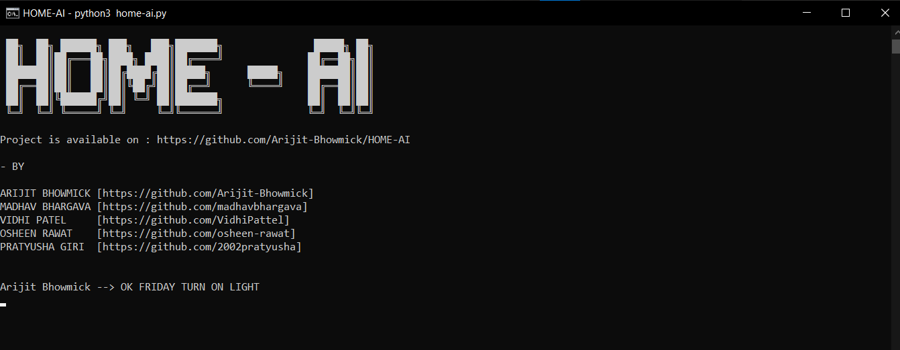

# HOME-AI
Just a College 1st Sem Physics Project

Project is available on : <i>https://github.com/Arijit-Bhowmick/HOME-AI</i>

# Members:

<a href="https://github.com/Arijit-Bhowmick">ARIJIT BHOWMICK</a> 
<a href="https://github.com/madhavbhargava">MADHAV BHARGAVA</a> 
<a href="https://github.com/VidhiPattel">VIDHI PATEL</a> 
<a href="https://github.com/osheen-rawat">OSHEEN RAWAT</a> 
<a href="https://github.com/2002pratyusha">PRATYUSHA GIRI</a> 

# Documentation

The Documentation of this project has been uploaded <a href="Documentation/HOME-AI_documentation.pdf">here</a> 
The usage and other details related to this project are mentioned in this <a href="Documentation/HOME-AI_documentation.pdf">documentation</a>

# SUPPORT THIS PROJECT

This Repository is discontinued from now on, and it's continuation and upgraded Version will be found at [AUTOME-AI](https://github.com/sys41x4/AUTOME-AI)

## Do you want to provide support ?

Then you can do so from <a href="https://sys41x4.github.io/support/sys41x4">here</a>
